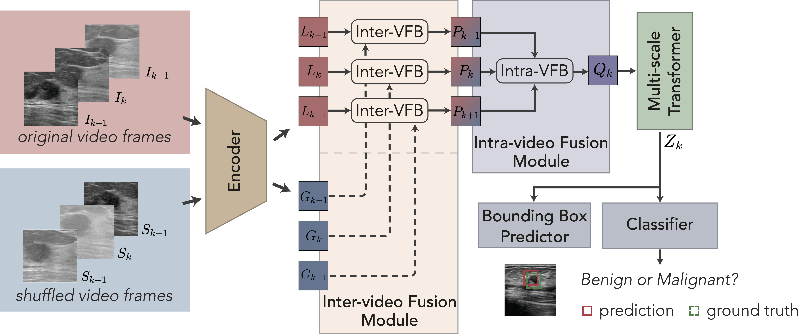

# CVA-Net
This repository is an official implementation of the paper [A New Dataset and A Baseline Model for Breast Lesion Detection in Ultrasound Videos](http://arxiv.org/abs/2207.00141). (MICCAI-2022)




## Abstract
Breast lesion detection in ultrasound is critical for breast cancer
diagnosis. Existing methods mainly rely on individual 2D ultrasound images or
combine unlabeled video and labeled 2D images to train models for breast lesion
detection. In this paper, we first collect and annotate an ultrasound video
dataset (188 videos) for breast lesion detection. Moreover, we propose a
clip-level and video-level feature aggregated network (CVA-Net) for addressing
breast lesion detection in ultrasound videos by aggregating video-level lesion
classification features and clip-level temporal features. The clip-level
temporal features encode local temporal information of ordered video frames and
global temporal information of shuffled video frames. In our CVA-Net, an
inter-video fusion module is devised to fuse local features from original video
frames and global features from shuffled video frames, and an intra-video
fusion module is devised to learn the temporal information among adjacent video
frames. Moreover, we learn video-level features to classify the breast lesions
of the original video as benign or malignant lesions to further enhance the
final breast lesion detection performance in ultrasound videos. Experimental
results on our annotated dataset demonstrate that our CVA-Net clearly
outperforms state-of-the-art methods.


## Citing CVA-Net
If you find CVA-Net useful in your research, please consider citing:
```
@article{lin2022new,
  title={A New Dataset and A Baseline Model for Breast Lesion Detection in Ultrasound Videos},
  author={Lin, Zhi and Lin, Junhao and Zhu, Lei and Fu, Huazhu and Qin, Jing and Wang, Liansheng},
  journal={arXiv preprint arXiv:2207.00141},
  year={2022}
}
```


## Usage

### Dataset preparation

Please download the dataset [https://pan.baidu.com/s/1yYME7-DvvIEZzCb72NXaJA?pwd=jnie] and organize them as following:

```
code_root/
└── datasets/
      ├── rawframes/
      ├── train.json
      └── val.json
```

### Pretrained Models
coming soon.

### Training

#### Training on single node

For example, the command for training CVA-NET on 8 GPUs is as following:

```bash
GPUS_PER_NODE=8 ./tools/run_dist_launch.sh 8 ./configs/configs.sh
```

#### Training on multiple nodes

For example, the command for training  on 2 nodes of each with 8 GPUs is as following:

On node 1:

```bash
MASTER_ADDR=<IP address of node 1> NODE_RANK=0 GPUS_PER_NODE=8 ./tools/run_dist_launch.sh 16 ./configs/configs.sh
```

On node 2:

```bash
MASTER_ADDR=<IP address of node 1> NODE_RANK=1 GPUS_PER_NODE=8 ./tools/run_dist_launch.sh 16 ./configs/configs.sh
```

#### Training on slurm cluster

If you are using slurm cluster, you can simply run the following command to train on 1 node with 8 GPUs:

```bash
GPUS_PER_NODE=8 ./tools/run_dist_slurm.sh <partition> CVA-Net 8 configs/configs.sh
```

Or 2 nodes of  each with 8 GPUs:

```bash
GPUS_PER_NODE=8 ./tools/run_dist_slurm.sh <partition> CVA-Net 16 configs/configs.sh
```
#### Some tips to speed-up training
* If your file system is slow to read images, you may consider enabling '--cache_mode' option to load whole dataset into memory at the beginning of training.
* You may increase the batch size to maximize the GPU utilization, according to GPU memory of yours, e.g., set '--batch_size 3' or '--batch_size 4'.

### Evaluation

You can get the config file and pretrained model of CVA-Net (the link is in "Main Results" session), then run following command to evaluate it on the validation set:

```bash
<path to config file> --resume <path to pre-trained model> --eval
```

You can also run distributed evaluation by using ```./tools/run_dist_launch.sh``` or ```./tools/run_dist_slurm.sh```.

## Notes
The code of this repository is built on
https://github.com/fundamentalvision/Deformable-DETR.
